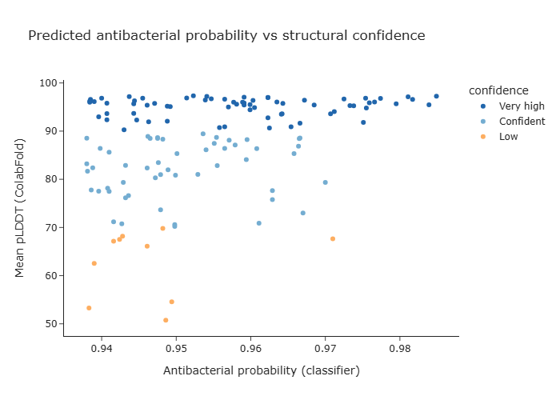
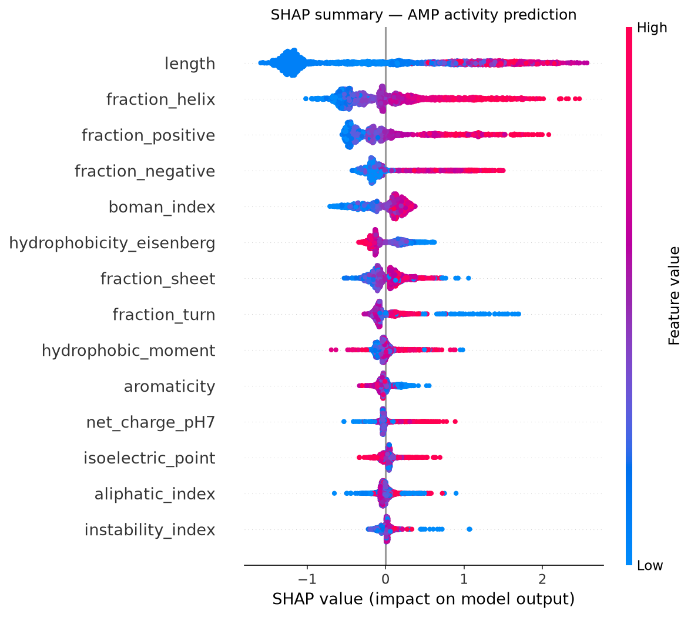
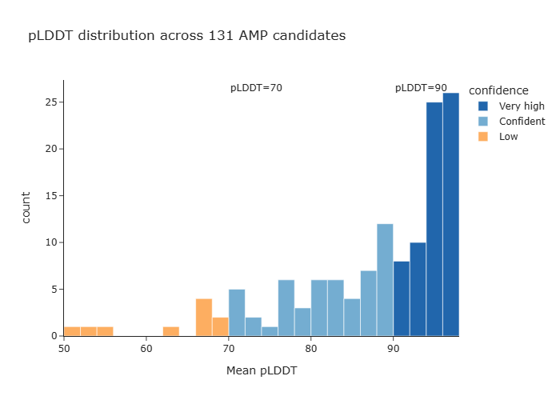
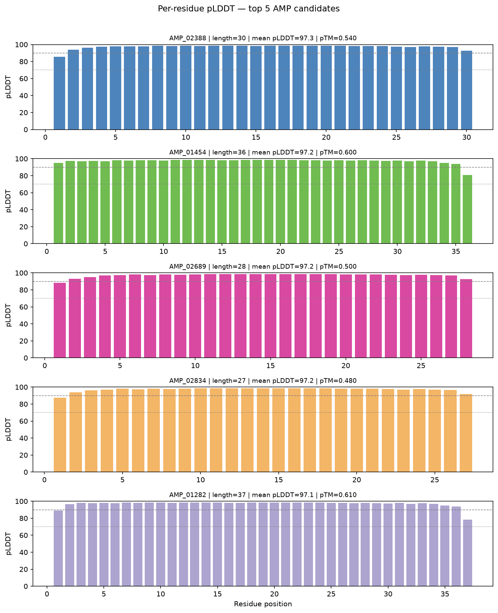

# AMP-ColabFold: Antimicrobial Peptide Screening Pipeline

> Computational screening of antimicrobial peptide candidates from 12,435 curated sequences using physicochemical feature modelling, gradient boosting classification, and ColabFold structure prediction.



---

## Key results

| Metric | Value |
|--------|-------|
| Curated AMP sequences (DRAMP 4.0) | 12,435 |
| Physicochemical features engineered | 16 |
| Activity classifier ROC-AUC | 0.77 |
| Peptides sent to ColabFold | 131 |
| High-confidence structures (pLDDT ≥ 70) | 69 |
| Very high-confidence structures (pLDDT ≥ 90) | 47 |
| Top candidate pLDDT | 97.3 (AMP_02388, 30 aa) |

---

## Motivation

Antimicrobial resistance (AMR) is projected to cause 10 million deaths annually by 2050.
Antimicrobial peptides (AMPs) are a promising therapeutic class — cationic, membrane-disrupting
peptides with broad-spectrum activity and low resistance development rates. Computational
screening accelerates the identification of viable candidates before expensive wet-lab synthesis.

This pipeline moves from raw database sequences through feature-based activity prediction
to structure prediction, producing a shortlist of high-confidence antibacterial candidates
with both sequence-level and structural evidence.

---

## Pipeline
DRAMP 4.0 (24,076 sequences)

│

▼

Length + canonical AA filter

90% identity clustering (Python CD-HIT)

│

▼

12,435 curated AMPs

│

▼

16 physicochemical features

(charge, hydrophobic moment, Chou-Fasman, Boman index ...)

│

▼

Gradient boosting classifier  ──► ROC-AUC 0.77

SHAP feature importance       ──► length, fraction_helix, fraction_positive

│

▼

Top 131 candidates (ab_proba ≥ 0.938, low-complexity filtered)

│

▼

ColabFold (alphafold2_ptm, 3 recycles, single-sequence mode)

│

▼

69 high-confidence structures

47 very high confidence (pLDDT ≥ 90)
---

## Repository structure
amp-colabfold/

├── data/

│   ├── raw/                        # DRAMP 4.0 download

│   └── processed/                  # Curated FASTA, feature CSV, structure summary

├── notebooks/

│   ├── 01_data_curation.ipynb      # Download, filter, cluster

│   ├── 02_structural_features.ipynb # Physicochemical feature engineering

│   ├── 03_activity_modelling.ipynb  # Gradient boosting + SHAP

│   └── 04_structure_analysis.ipynb  # pLDDT/PAE parsing and figures

├── src/amp_colabfold/

│   ├── curation.py                 # DRAMP fetching, CD-HIT clustering

│   ├── features.py                 # Physicochemical feature computation

│   ├── models.py                   # Classifier, SHAP analysis

│   └── structure_utils.py          # PDB/JSON parsing, confidence classification

├── results/

│   ├── candidate_amps.csv          # Final 69 high-confidence candidates

│   ├── model_performance.csv       # Classifier metrics

│   ├── shap_importance.csv         # Feature importance table

│   └── figures/                    # All publication-quality figures

└── environment.yml
---

## Figures

### SHAP feature importance


**Key finding:** peptide length, helix propensity, and cationic residue fraction
are the strongest predictors of antibacterial activity — consistent with the
canonical α-helical membrane disruption mechanism.

### pLDDT distribution


### Per-residue pLDDT — top 5 candidates


---

## Top candidates

| AMP ID | Length (aa) | Mean pLDDT | pTM | ab_proba | Confidence |
|--------|------------|------------|-----|----------|------------|
| AMP_02388 | 30 | 97.3 | 0.54 | 0.952 | Very high |
| AMP_01454 | 36 | 97.2 | 0.60 | 0.985 | Very high |
| AMP_02689 | 28 | 97.2 | 0.50 | 0.954 | Very high |
| AMP_01282 | 37 | 97.1 | 0.61 | 0.981 | Very high |
| AMP_01129 | 38 | 97.0 | 0.62 | 0.959 | Very high |

Full candidate list: [`results/candidate_amps.csv`](results/candidate_amps.csv)

---

## Reproducing this analysis

```bash
# 1. Clone the repo
git clone https://github.com/Farhan89082/amp-colabfold.git
cd amp-colabfold

# 2. Create the environment
pip install -r requirements.txt   # or: conda env create -f environment.yml

# 3. Run notebooks in order
# notebooks/01_data_curation.ipynb
# notebooks/02_structural_features.ipynb
# notebooks/03_activity_modelling.ipynb
# notebooks/04_structure_analysis.ipynb

# 4. ColabFold structure prediction
# See notebooks/04_structure_analysis.ipynb for Colab instructions
# Input FASTA: data/processed/colabfold_input.fasta
```

**Note:** ColabFold structure prediction was run on Google Colab (free T4 GPU).
The raw PDB and JSON output files are available on request — not committed to
the repo due to size. The parsed summary is at `data/processed/structure_summary.csv`.

---

## Methods summary

**Data curation:** Sequences downloaded from DRAMP 4.0 (general, antibacterial,
and natural AMP subsets). Filtered to length 10–50 aa, canonical amino acids only.
Clustered at 90% sequence identity using a Python reimplementation of the CD-HIT
greedy algorithm.

**Feature engineering:** 16 physicochemical features computed per sequence using
the `peptides` Python package, including net charge at pH 7, hydrophobic moment
(Eisenberg, α-helical angle), Boman interaction index, Chou-Fasman secondary
structure propensities, aliphatic index, and aromaticity.

**Activity modelling:** Gradient boosting classifier (300 estimators, max depth 3,
subsample 0.8) trained on binary labels (antibacterial vs general/natural).
Train/test split stratified by sequence length decile to reduce data leakage.
SHAP TreeExplainer used for feature attribution.

**Structure prediction:** Top 131 candidates (ab_proba ≥ 0.938, low-complexity
filtered) folded with ColabFold 1.6.1 (alphafold2_ptm model, 3 recycles,
single-sequence mode). Structures ranked by pLDDT. High-confidence set defined
as pLDDT ≥ 70 AND ab_proba ≥ 0.95.

---

## Dependencies

- Python 3.12
- biopython, pandas, numpy, scikit-learn, shap
- plotly, matplotlib, seaborn
- peptides
- ColabFold 1.6.1 (structure prediction, Google Colab)

---

## Citation

If you use this pipeline, please cite:

- Mirdita M. et al. ColabFold: Making protein folding accessible to all. *Nature Methods* (2022)
- Yang et al. DRAMP 3.0: a comprehensive database of antimicrobial peptides. *Nucleic Acids Research* (2022)

---

## Author

**Farhan** — [@Farhan89082](https://github.com/Farhan89082)